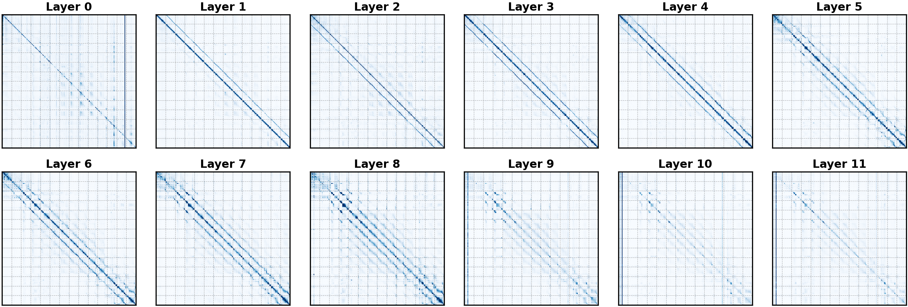
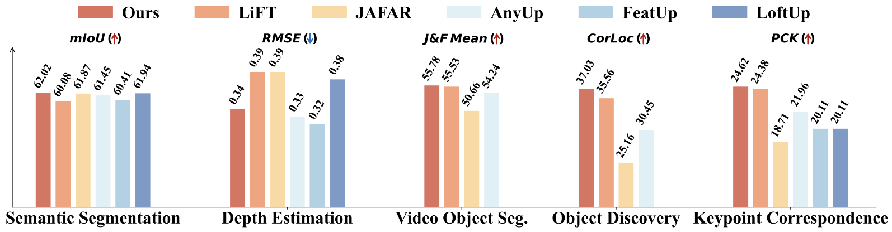
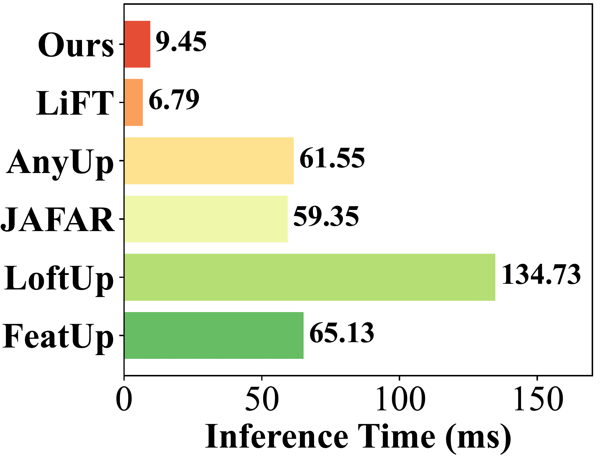
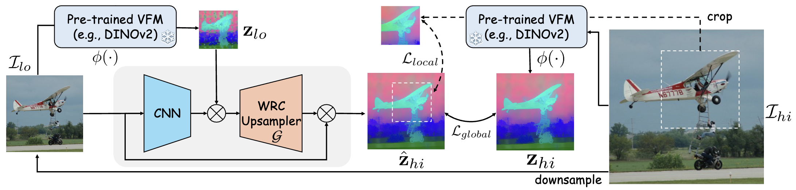
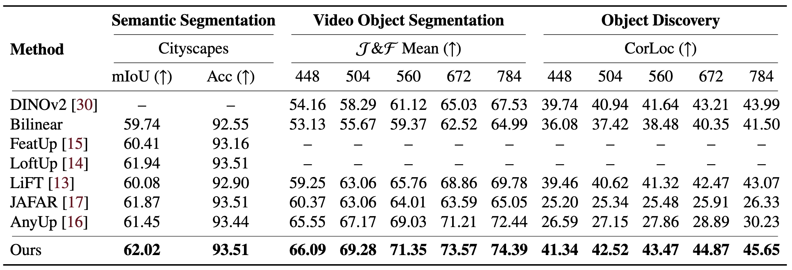
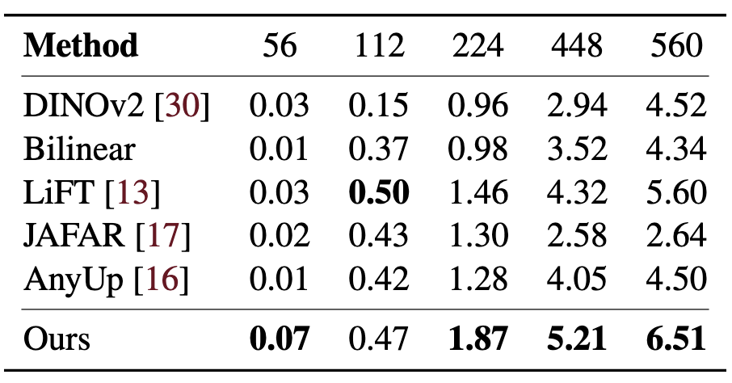
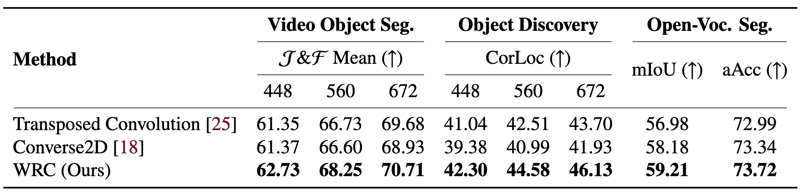
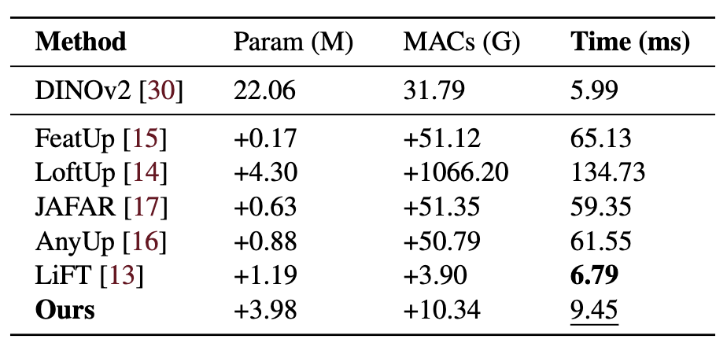
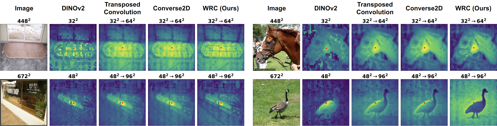

# [Weighted Reverse Convolution for Feature Upsampling](https://arxiv.org/abs/2605.17472)

Wentong Li<sup>1,&ast;</sup>, Zhiyuan Qi<sup>1,2,&ast;</sup>, Zichen Zhao<sup>1</sup>, Kai Zhang<sup>3</sup>, Lei Zhang<sup>2,†</sup>

<sup>1</sup>Nanjing University of Aeronautics and Astronautics  
<sup>2</sup>The Hong Kong Polytechnic University  
<sup>3</sup>Nanjing University


---
- [Update](#update)
- [Motivation](#motivation)
- [Method](#method)
- [Code](#code)
- [Experiments](#experiments)
- [Visualization](#visualization)
- [Citation](#citation)


## Update

- **2026.05.19:** The paper and codes are released.

## Motivation

Pre-trained vision foundation models (VFMs), such as DINO and CLIP, provide strong transferable semantic representations. However, their patch-level features are usually spatially coarse because images are tokenized with large patch strides. This limits their effectiveness on dense prediction and correspondence tasks that require precise boundaries, localized activations, and stable point-wise descriptors.

Feature upsampling offers a practical alternative to increasing input resolution or modifying the backbone: the VFM remains frozen, while a lightweight module reconstructs denser features for downstream tasks. Existing upsampling methods often face a trade-off between preserving fine spatial details and maintaining inference efficiency.

We revisit feature upsampling from an inverse-problem perspective and propose **Weighted Reverse Convolution (WRC)**, a differentiable, closed-form feature upsampler designed for dense VFM descriptors.



We also observe near Block Circulant with Circulant Blocks (BCCB) patterns in VFM attention maps, which motivates applying Fourier-friendly inverse operators to dense transformer features.

WRC consistently improves dense features across semantic segmentation, depth estimation, video object segmentation, object discovery, and keypoint correspondence, while preserving fast inference.

<p align="center">
  
  
</p>


## Method



WRC formulates feature upsampling as a weighted inverse problem. Given low-resolution features, a convolution kernel, and a prior estimate, WRC reconstructs high-resolution features by solving a weighted least-squares objective with Tikhonov regularization.

Compared with standard reverse convolution, WRC introduces spatially adaptive weights for both:

- **Data Fidelity**, which controls how strongly each location should match the observed low-resolution feature;
- **Regularization**, which controls how strongly each reconstructed location should follow the prior.

This design lets the model preserve discriminative semantic structures while stabilizing ill-conditioned regions. Under circular boundary assumptions, the objective admits an efficient FFT-based closed-form solution, making WRC fully differentiable and practical as a plug-and-play upsampling operator for frozen VFMs.


## Code

### Project Layout

```text
WRC/
|-- assets/            # Example assets and small files used by demos or documentation.
|-- config/            # Hydra configs for training, evaluation, datasets, models, and optimizers.
|-- evaluation/        # Evaluation scripts, dataset wrappers, feature extractor, and external eval toolkits.
|-- hydra_plugins/     # Custom OmegaConf/Hydra resolvers used by the config system.
|-- torch_wrc/         # Custom C++/CUDA extension for weighted reverse convolution.
|-- utils/             # Lightweight image, training, and visualization helpers.
|-- wrc/               # Core WRC Python package with model, layers, losses, and utilities.
|-- .gitignore         # Local cache, output, and editor ignore rules.
|-- README.md          # Project overview and usage notes.
|-- pyproject.toml     # Python package metadata and editable-install configuration.
|-- requirements.txt   # Pinned Python dependencies reconstructed from the saved environment.
`-- train_wrc.py       # Main WRC training entry point.
```

### Quick Start

Install the required dependencies for training:
```bash
conda create -n wrc python=3.12 -y
codna activate wrc
pip install uv

uv pip install torch==2.9.0 torchvision==0.24.0 --index-url https://download.pytorch.org/whl/cu128

uv pip install -r requirements.txt
```

Train WRC:

```bash
python train_wrc.py \
    model=wrc \
    train_dataloader.batch_size=4 \
    optimizer.lr=1e-3 \
    backbone.name=vit_small_patch14_dinov2.lvd142m \
    hydra.run.dir='./work_dirs/test'
```

Run WRC probe training:

```bash
python evaluation/train_probe.py \
  dataset_evaluation=cityscapes \
  eval.task=seg \
  model=wrc \
  backbone.name=vit_small_patch14_dinov2.lvd142m \
  eval.model_ckpt=/path/to/wrc/checkpoint.pth \
  hydra.run.dir='./work_dirs/linear_probe/wrc/${dataset_evaluation.tag}/${backbone.name}/${now:%Y-%m-%d-%H-%M-%S}'
```


## Experiments

We evaluate WRC across multiple dense visual understanding tasks using frozen VFMs. Unless otherwise specified, experiments use DINOv2-ViT-S/14 as the backbone.

### Main Results



Table 1 reports linear probing semantic segmentation on Cityscapes, video object segmentation on DAVIS, and unsupervised object discovery on COCO20K. WRC achieves the best overall performance across the reported dense prediction and correspondence-oriented benchmarks.

<p align="center">
  
</p>

Table 2 reports keypoint correspondence on SPair-71k. WRC improves PCK at high input resolutions, indicating stronger spatially precise descriptors.

### Comparison with Upsampling Operators



We compare WRC with transposed convolution and Converse2D under the same framework. WRC provides stronger results on video object segmentation, object discovery, and open-vocabulary segmentation.

### Efficiency

<p align="center">
  
</p>

All timing results are measured with DINOv2-ViT-S/14, 2x feature upsampling, 448x448 input resolution, and single-image inference on one NVIDIA A100 GPU.

## Visualization

WRC produces sharper and more localized similarity maps than common upsampling operators, especially around queried points and object boundaries.



## Citation

```bibtex

@article{li2026WRC,
  title={Weighted Reverse Convolution for Feature Upsampling},
  author={Li, Wentong and Qi, Zhiyuan and Zhao, Zichen and Zhang, Kai and Zhang, Lei},
  journal={arXiv preprint arXiv: 2605.17472},
  year={2026}
}
```
